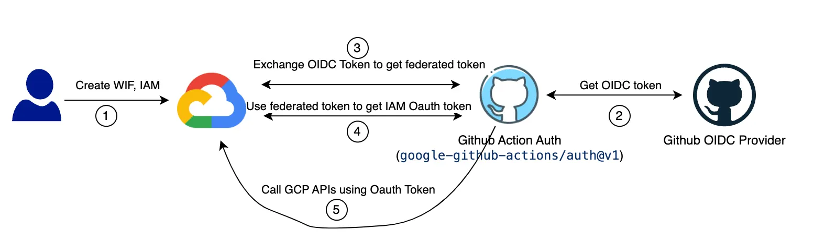
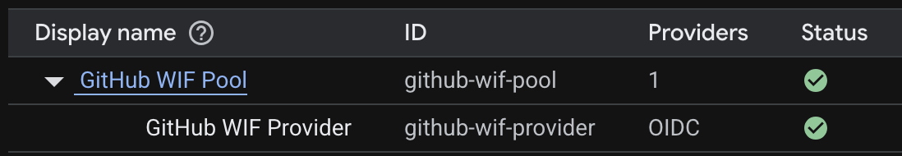

# Restaurant Management API

A robust RESTful API built for restaurant order and table management.
This system allows restaurant staff to manage tables, track orders, and process customer interactions efficiently.


## 🍽️ Features

- **Product Management**: Create, read, update, and delete menu items
- **Table Management**: Track available tables and their status
- **Session Management**: Open and close table sessions for customers
- **Order Processing**: Create and track orders with detailed information
- **Order Summary**: Calculate order totals and quantities per table session

## 🛠️ Technologies

- **[Node.js](https://nodejs.org/)**: JavaScript runtime
- **[Express](https://expressjs.com/)**: Web framework
- **[TypeScript](https://www.typescriptlang.org/)**: Type safety and enhanced developer experience
- **[Knex.js](https://knexjs.org/)**: SQL query builder
- **[SQLite](https://www.sqlite.org/)**: Lightweight database
- **[Zod](https://zod.dev/)**: Robust schema validation

## 📋 API Endpoints

### Products

- `GET /products` - List all products (with optional name filter)
- `POST /products` - Create a new product
- `PUT /products/:id` - Update an existing product
- `DELETE /products/:id` - Remove a product

### Tables

- `GET /tables` - List all tables

### Table Sessions

- `POST /tables-sessions` - Open a new table session
- `GET /tables-sessions` - List all table sessions
- `PATCH /tables-sessions/:id` - Close a table session

### Orders

- `POST /orders` - Create a new order
- `GET /orders/table-session/:table_session_id` - Get all orders for a table session
- `GET /orders/table-session/:table_session_id/total` - Get order summary for a table session

## 🚀 Getting Started

### Prerequisites

- Node.js (v20 or higher)
- npm or yarn

### Installation

1. Clone the repository

   ```bash
   git clone https://github.com/batavoo/api-restaurant.git
   cd api-restaurant
   ```

2. Install dependencies

   ```bash
   npm install
   # or
   yarn
   ```

3. Run migrations to setup the database

   ```bash
   npm run knex migrate:latest
   ```

4. Seed the database with initial data

   ```bash
   npm run knex seed:run
   ```

5. Start the development server

   ```bash
   npm run dev
   ```

## 💾 Database Schema

The application uses SQLite with the following tables:

- **products**: Menu items with prices
- **tables**: Restaurant tables
- **tables_sessions**: Track when tables are opened and closed
- **orders**: Store orders with product information, quantity, and pricing

## 💻 Infrastructure

> Google Cloud Run documentation: <https://cloud.google.com/run?hl=pt-BR>

The application has its source code deployed on Cloud Run whenever a commit is pushed to the `develop` or `main` branches.

### Required Google Cloud APIs

- Artifact Registry API (artifactregistry.googleapis.com)
- Cloud Build API (cloudbuild.googleapis.com)
- Cloud Run Admin API (run.googleapis.com)
- ~~Cloud Functions API~~

### Continuous Deployment

#### Workload Identity Federation for GitHub provider

In order to deploy the application to Cloud Run, GitHub needs to be authorized with GCP.

It could be done by generating a JSON key for a Service Account (that has sufficient IAM roles) and storing it in the GitHub repository as a Secret.
Then we use this Service Account key to call GCP APIs, but this approach is somewhat risky in case that key is leaked.

Fortunately, GCP has a safer way to implement the same thing using [Workload Identity Federation](https://cloud.google.com/iam/docs/workload-identity-federation?hl=pt-br).



A *Workload Identity Pool* is used to manage external identities outside the GCP environment.

A *Workload Identity Pool Provider* describes the relationship between Google Cloud and an external Identity Provider (IdP).
In this case, the external IdP is GitHub OIDC Provider.
GCP IAM uses a token of the GitHub OIDC provider to authorize the permission on GCP resources.



---

Developed by [Gustavo Santos Arruda](https://www.linkedin.com/in/gustavo-santos-arruda/)
